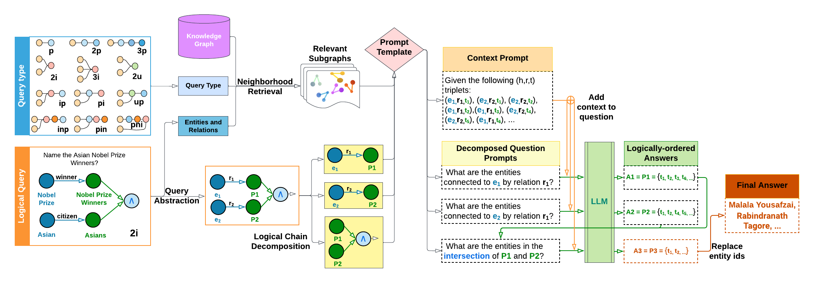

# Reasoning over Knowledge Graphs using Large Language Models

### Abstract
Reasoning over knowledge graphs (KGs) is a challenging task that requires a deep
understanding of the complex relationships between entities and the underlying
logic of their relations. Current approaches rely on learning geometries to embed
entities in vector space for logical query operations, but they suffer from subpar
performance on complex queries and dataset-specific representations. In this paper,
we propose a novel decoupled approach, Language-guided Abstract Reasoning
over Knowledge graphs (LARK), that formulates complex KG reasoning as a
combination of contextual KG search and abstract logical query reasoning, to
leverage the strengths of graph extraction algorithms and large language models
(LLM), respectively. Our experiments demonstrate that the proposed approach
outperforms state-of-the-art KG reasoning methods on standard benchmark datasets
across several logical query constructs, with significant performance gain for
queries of higher complexity. Furthermore, we show that the performance of our
approach improves proportionally to the increase in size of the underlying LLM,
enabling the integration of the latest advancements in LLMs for logical reasoning
over KGs. Our work presents a new direction for addressing the challenges of
complex KG reasoning and paves the way for future research in this area.
